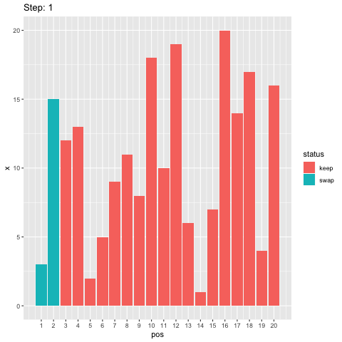

# animated_bubble_sort

Animation of sorting N integers using bubble sort in R.


## Draw random sample

```r
N <- 20
set.seed(2018)
x <- sample(N)
```

## Bubble sort algorithm

```r
lst <- list()
step <- 0
for (i in 1:(length(x) - 1)) {
    for (j in 1:(length(x) - i)) {
        if (x[j] > x[j+1]) {
            step <- step + 1
            tmp <- x[j]
            x[j] <- x[j + 1]
            x[j + 1] <- tmp
            lst[[step]] <- data.frame(
                pos = 1:length(x),
                x = x,
                status = replace(rep("keep", length(x)), c(j, j + 1), "swap"))
        }
    }
}
```

## Animate using `gganimate`

```r
library(gganimate)
library(tidyverse)
a <- bind_rows(lst, .id = "step") %>%
    mutate(step = factor(step, levels = 1:length(lst))) %>%
    ggplot(aes(pos, x, fill = status)) +
    geom_col() +
    scale_x_continuous(breaks = 1:length(x)) +
    labs(title = "Step: {current_frame}") +
    transition_manual(step) +
    ease_aes("linear")
animate(a, end_pause = 10)
anim_save("animation.gif")
```


